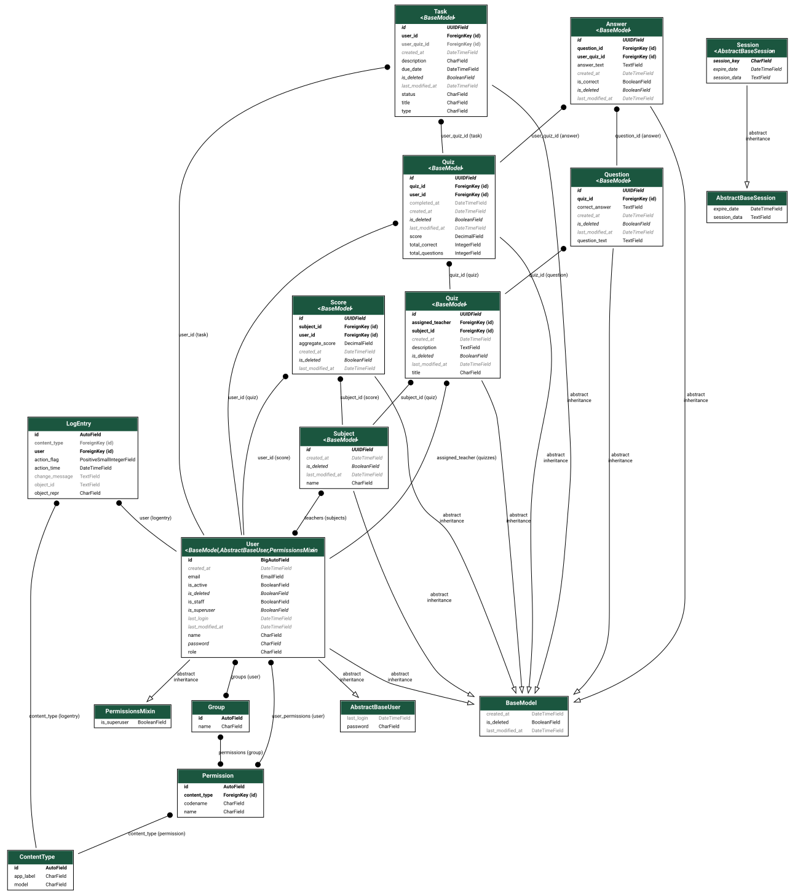

# Quiz Application Project

## Overview

This repository contains two main components for a quiz application:

- **Python CLI App** (`python/`):  
  A command-line quiz app supporting, score tracking, and immediate feedback.
- **Django REST Backend** (`backend/`):  
  A web backend built with Django and Django REST Framework, designed to power the same quiz system for web or API clients.

## Features

### Python CLI App

- Score tracking
- Immediate feedback on answers
- Simple and easy-to-understand codebase
- Built with **Python 3.13**
- Requirements managed via `requirements.txt`

### Django REST Backend

- RESTful API for quizzes, questions, users, and scores
- Built with Django and Django REST Framework
- Designed for extensibility (user authentication, performance tracking)
- Follows the same data model as the CLI app, with added leaderboard capability
- Uses PostgreSQL as the database backend

## Folder Structure

```
repo-root/
├── python/
│   ├── quiz.py
│   ├── requirements.txt
│   └── ...
├── backend/
│   ├── manage.py
│   ├── backend_excercise/
│   ├── quiz/
│   └── ...
├── docs/
│   └── erd_diagram.png
├── README.md
└── ...
```

## Getting Started

### Python CLI App

1. **Navigate to the `python/` directory:**
   ```bash
   cd python
   ```
2. **Install requirements:**
   ```bash
   pip install -r requirements.txt
   ```
3. **Run the quiz app:**
   ```bash
   python quiz.py
   ```

### Django REST Backend

1. **Navigate to the `backend/` directory:**
   ```bash
   cd backend
   ```
2. **Set up a virtual environment and install requirements:**
   ```bash
   python -m venv env
   source env/bin/activate  # On Windows: env\Scripts\activate
   pip install -r requirements.txt
   ```
3. **Run migrations:**
   ```bash
   python manage.py migrate
   ```
4. **Start the development server:**
   ```bash
   python manage.py runserver
   ```

## Entity-Relationship Diagram (ERD)

The following diagram illustrates the core data model for the schema:

%20-%20Quiz%20App.svg)

## Django Models Diagram

The following diagram illustrates the core data model shared by the backend app:




- Use the Django REST backend to build web or mobile clients.
- Contribute by opening issues or pull requests.

## Requirements

- **Python 3.13+** (for CLI app)
- **Django** and **Django REST Framework** (for backend)
- All dependencies are listed in the respective `requirements.txt` files.

## License

This project is open source and available under the [MIT License](LICENSE).

## Contributing

Contributions are welcome! Please fork the repo and submit a pull request.

## Contact

For questions or support, please open an issue in the repository.

## Django REST Framework (DRF) API

This project uses **Django REST Framework (DRF)** to build a modular, secure, and efficient API for all backend functionality.

### Apps Included
- **users**: User registration, authentication (JWT), profile management, and role-based access.
- **quiz**: Quizzes, questions, subjects, and teacher assignment.
- **participation**: User answers, scores, and tasks.

### Authentication
- Uses JWT tokens via a custom lightweight authentication class (`LightweightJWTAuthentication`).
- All endpoints requiring authentication expect a JWT Bearer token.

### Permissions
- Role-based permissions (admin, teacher, student) are enforced using JWT claims—no database query for user roles.
- Custom permission classes ensure only authorized users can create, update, or delete resources.

### API Features
- CRUD operations for quizzes, questions, subjects, answers, scores, and tasks.
- Filtering, searching, and ordering for list endpoints.
- Pagination for large result sets.
- OpenAPI/Swagger documentation via drf-spectacular, with JWT authentication available for all endpoints.

### Testing
- Full coverage with pytest and DRF’s APIClient.
- Tests are organized per app for maintainability.
